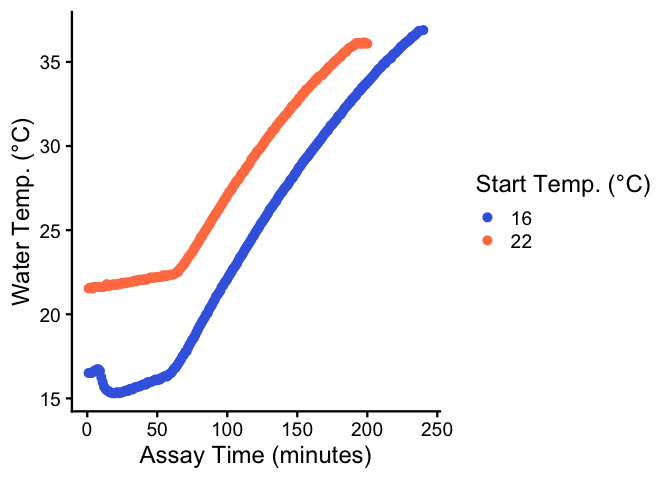
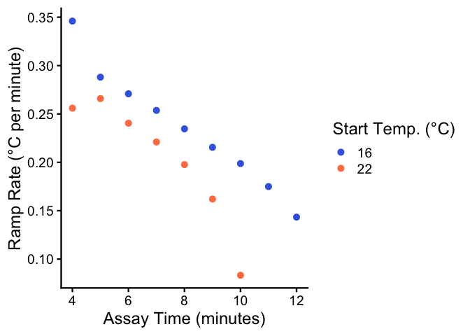
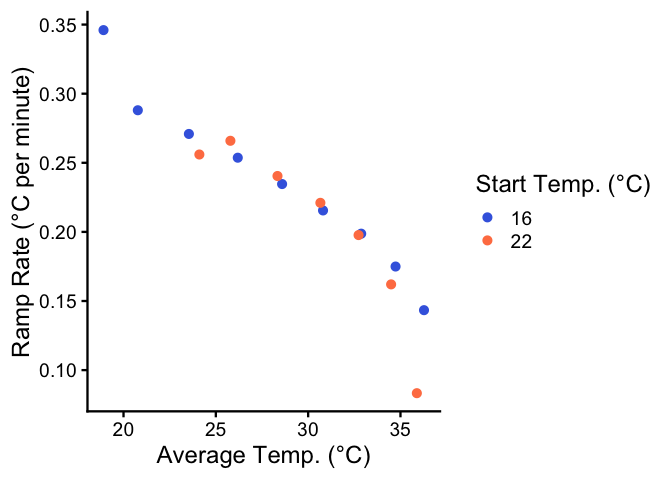
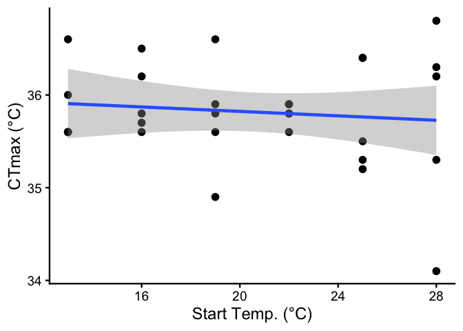

Start temperature does not affect copepod CTmax
================
2026-06-29

- [CTmax Data](#ctmax-data)
- [References](#references)

Several studies have shown that the temperature a CTmax assay starts at
can affect the observed upper thermal limit (Terblanche et al. 2007).
This seems like it may be species-specific, however, with highly
variable results across species (Faber et al., n.d.), and even across
populations of the same species (Cicchino et al. 2024).

While the effect of start temperature can be quite clear, the underlying
mechanism is still unknown. Much of the past work has been done with
terrestrial organisms (like insects) - in these systems, dehydration is
a major risk during experiments. As a result, the effect of starting
temperature on CTmax may reflect the changes in duration, rather than
the direct effect of a different initial temperature.

In theory, without confounding effects of other processes like
dehydration and starvation, starting temperature should have minimal
effect on CTmax so long as the assay starts below the critical
temperature, or the point where damage accumulation outpaces damage
repair (Faber et al., n.d.). This project examines how CTmax varies with
starting temperature in Skistodiaptomus pallidus, a widespread
freshwater calanoid copepod.

For the initial assays, we tracked temperature in the water bath during
the experiments. The temperatures increased steadily throughout the
assays.

``` r
ggplot(comb_data, aes(x = time_point, y = temp_c, colour = start_temp)) + 
  geom_point() + 
  labs(y = "Water Temp. (°C)",
       colour = "Start Temp. (°C)", 
       x = "Assay Time (minutes)") + 
  scale_colour_manual(values = c("royalblue", "coral")) + 
  theme_classic(base_size = 18)
```



Ramping rates (calculated for 10 minute intervals throughout the
experiment) decreased over time, as expected.

``` r

mean_temps = comb_data %>% 
  mutate(minutes = time_point / 2) %>% 
  filter(time_point > 75) %>% 
  drop_na(temp_c) %>% 
  group_by(start_temp, ten_min_int) %>% 
  summarise(mean_temp = mean(temp_c))

ramp_rates = comb_data %>% 
  mutate(minutes = time_point / 2) %>% 
  filter(time_point > 75) %>% 
  drop_na(temp_c) %>% 
  group_by(start_temp, ten_min_int) %>% 
  nest() %>%
  mutate(
    # Fit the linear model to each interval's data
    model = map(data, ~ lm(temp_c ~ minutes, data = .x)),
    # Tidy the model object into a dataframe
    tidied = map(model, tidy)
  ) %>%
  unnest(tidied) %>%
  # Filter to get just the slope (the coefficient for 'time')
  filter(term == "minutes") %>% 
  inner_join(mean_temps, by = c("start_temp", "ten_min_int"))


ggplot(ramp_rates, aes(x = ten_min_int, y = estimate, colour = start_temp)) + 
  geom_point() + 
  labs(y = "Ramp Rate (°C per minute)",
       x = "Assay Time (minutes)", 
       colour = "Start Temp. (°C)") + 
    scale_colour_manual(values = c("royalblue", "coral")) + 
  theme_classic(base_size = 18)
```



As shown in previous work with this setup, this decrease in ramping
rates was strongly related to the average water temperature during the
time interval, regardless of starting temperature.

``` r

ggplot(ramp_rates, aes(x = mean_temp, y = estimate, colour = start_temp)) + 
  geom_point() + 
  labs(y = "Ramp Rate (°C per minute)",
       x = "Average Temp. (°C)", 
       colour = "Start Temp. (°C)") + 
      scale_colour_manual(values = c("royalblue", "coral")) + 
  theme_classic(base_size = 18)
```



## CTmax Data

There was no relationship between observed CTmax and the starting
temperature.

``` r

ggplot(trait_data, aes(x = start_temp, y = ctmax)) + 
  geom_point(size = 3) + 
  geom_smooth(method = "lm") + 
  labs(y = "CTmax (°C)",
       x = "Start Temp. (°C)") + 
  theme_classic(base_size = 18)
```



This is supported by the results of a linear regression, which shows no
relationship between CTmax and starting temperature.

``` r

temp.model = lm(data = trait_data, 
                ctmax ~ start_temp)

summary(temp.model)
## 
## Call:
## lm(formula = ctmax ~ start_temp, data = trait_data)
## 
## Residuals:
##      Min       1Q   Median       3Q      Max 
## -1.62667 -0.29767 -0.01667  0.43733  1.07333 
## 
## Coefficients:
##             Estimate Std. Error t value Pr(>|t|)    
## (Intercept)  36.0627     0.4247  84.909   <2e-16 ***
## start_temp   -0.0120     0.0201  -0.597    0.555    
## ---
## Signif. codes:  0 '***' 0.001 '**' 0.01 '*' 0.05 '.' 0.1 ' ' 1
## 
## Residual standard error: 0.564 on 28 degrees of freedom
## Multiple R-squared:  0.01257,    Adjusted R-squared:  -0.0227 
## F-statistic: 0.3564 on 1 and 28 DF,  p-value: 0.5553

car::Anova(temp.model)
## Anova Table (Type II tests)
## 
## Response: ctmax
##            Sum Sq Df F value Pr(>F)
## start_temp 0.1134  1  0.3564 0.5553
## Residuals  8.9083 28
```

## References

<div id="refs" class="references csl-bib-body hanging-indent"
entry-spacing="0">

<div id="ref-cicchino2024" class="csl-entry">

Cicchino, Amanda S., Cameron K. Ghalambor, Brenna R. Forester, Jason D.
Dunham, and W. Chris Funk. 2024. “Greater Plasticity in CTmax with
Increased Climate Variability Among Populations of Tailed Frogs.”
*Proceedings of the Royal Society B: Biological Sciences* 291 (2034):
20241628. <https://doi.org/10.1098/rspb.2024.1628>.

</div>

<div id="ref-faber" class="csl-entry">

Faber, A., F. Møller, B. Ehlers, M. Ørsted, and J. Overgaard. n.d.
“Separating Good from Bad a Methodological Assessment of the Critical
Temperature That Separates Stressful and Permissive Temperatures in
Ectotherms.”

</div>

<div id="ref-terblanche2007" class="csl-entry">

Terblanche, John S, Jacques A Deere, Susana Clusella-Trullas, Charlene
Janion, and Steven L Chown. 2007. “Critical Thermal Limits Depend on
Methodological Context.” *Proceedings of the Royal Society B: Biological
Sciences* 274 (1628): 2935–43. <https://doi.org/10.1098/rspb.2007.0985>.

</div>

</div>
